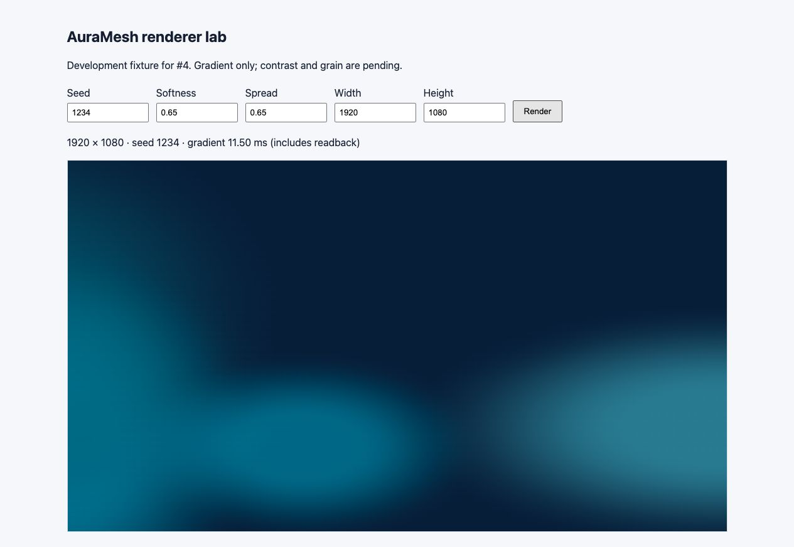
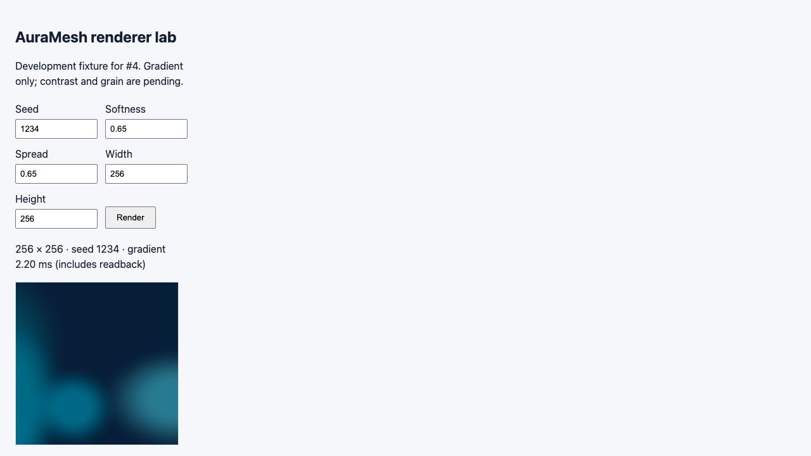

# Renderer v1: initial gradient QA

Recorded 7 October 2026 for issue #4 on `PJ/issue-4-gradient-renderer`. This covers gradient rendering only, not the product editor, grain/contrast, encoding/downloads or release browser support.

## Environment and automated checks

- Device: MacBook Pro, Apple M1 Pro (10-core CPU), 16 GB memory; macOS 27.0.1 (26A434).
- Runtime: Node 22.23.1, pnpm 11.19.0, Playwright 1.63.0, Chromium headless 153.0.8010.12, viewport 1280×720. Chromium UA reports macOS 10.15.7/Intel for compatibility; it is not the actual OS/chip.
- Unit/component: 97 passing tests, including normalized geometry/radius validation, softness stops, renderer errors and all #1/#3 tests.
- Browser: 6 passing tests. All-pixel opacity/nonuniform output at 256×256, 1024×1024, 1920×1080, 1080×1920 and 3840×2160; exact Canvas dimensions; frozen inputs; same-environment A→B→A SHA-256 equality; previous clip/transform/alpha/filter/compositing cleanup; softness radial probe; invalid-size recovery; no page/console errors; production fixture exclusion.
- The baseline test records timings but does not impose a performance pass/fail threshold.

## Manual visual checks

Inspected through the Codex in-app browser's development fixture, independently of the automated Chromium run. Its exact embedded browser version was not available; this does not substitute for the final Safari/Firefox/WebKit release matrix.

Fixed seed 1234, initial Ocean colors, softness/spread 0.65, contrast 1, grain 0:

| Canvas size | View inspected     | Result                                                                                               |
| ----------- | ------------------ | ---------------------------------------------------------------------------------------------------- |
| 256×256     | Entire small image | Soft colored fields over navy base; no blank output or rectangular field edge                        |
| 1024×1024   | Entire square page | Centers/radii consistent with small image; smooth edge transitions                                   |
| 1920×1080   | Scaled landscape   | Expected wider ellipses, no unexpected crop policy or uncovered background                           |
| 1080×1920   | Full portrait page | Same relative composition stretched vertically; off-frame fields clip at canvas boundary as intended |
| 3840×2160   | Scaled 4K          | Same landscape composition; no visible hard field boundary                                           |

Also inspected 1024×1024 at softness/spread 0/0 and 1/1. Minimum values show smaller, more distinct ellipses with a softened outer rim; maximum values widen coverage and transition. The darker open region above the fields is intentional for this seed. Initial softness/spread defaults remain 0.65; palette and grain calibration are deferred to #5/#7. Smooth dark gradients can still reveal slight banding; grain/contrast and encoded-file quality have not been evaluated here.

Screenshots include the development fixture and settings. They show scaled browser views, not exported image files or a cross-browser pixel golden:

## Initial performance baseline

Chromium headless on the device above, one discarded warm-up followed by seven samples per configuration. Timed operation: bitmap/context reset + gradient drawing + one-pixel readback to flush queued Canvas work. Scene construction, full ImageData reads, grain/contrast, encoding and download are excluded. Results include renderer reset cost; no claim is made about a GPU-only gradient duration.

| Size      | Scene                                   | Min / median / max (ms) |
| --------- | --------------------------------------- | ----------------------- |
| 1024×1024 | Ocean, seed 1234, spread 0.65           | 10.5 / 10.6 / 10.9      |
| 1024×1024 | Warm fixture, seed 4294967295, spread 1 | 17.8 / 18.0 / 18.2      |
| 3840×2160 | Ocean, seed 1234, spread 0.65           | 79.5 / 80.1 / 84.8      |
| 3840×2160 | Warm fixture, seed 4294967295, spread 1 | 138.5 / 139.5 / 143.3   |

Warm fixture colors: `#381B32`, `#F07858`, `#F2C879`; softness 0.65 for both fixtures. This broader-coverage sample is deliberately included alongside the initial default scene; it is not proof of a global worst case. Single interactive in-app samples were 37.1 ms at 1024×1024 and 31.6 ms at 4K, illustrating why different browser/renderer modes and cold runs should not be mixed into one timing guarantee.

The initial raw samples are preserved in [renderer-v1-baseline.json](renderer-v1-baseline.json). `pnpm test:e2e` records current samples in `test-results/.../gradient-baseline.json`. The table above is an initial snapshot and will not be rewritten on every run. Re-profile the full preview/export pipeline in #5/#6/#10/#14; do not use these results as a noisy CI timing gate or promise of mobile/4K export performance.

## Reproduce

1. Install the pinned Node/pnpm, run `pnpm install --frozen-lockfile`, then `pnpm exec playwright install chromium`.
2. Run `pnpm verify` for lint/format/typecheck/unit/build/browser smoke, or `pnpm test:e2e` for build/browser checks alone.
3. Run `pnpm dev` and open `/__renderer-demo` at the printed URL. Keep seed 1234 and softness/spread 0.65; render each size in the matrix above. Check the full image and its boundary.
4. Render 1024×1024 at softness/spread 0/0, then 1/1. Return to 0.65/0.65 and seed 1234. Check that the original composition returns.
5. Inspect the baseline JSON from the browser suite. Stop the temporary dev server when finished.

Still pending: full editor interaction/accessibility, encoded PNG/JPEG validation, grain/contrast calibration, broad palette/seed visual matrix, memory/repeated-export profiling and the release browser matrix.
