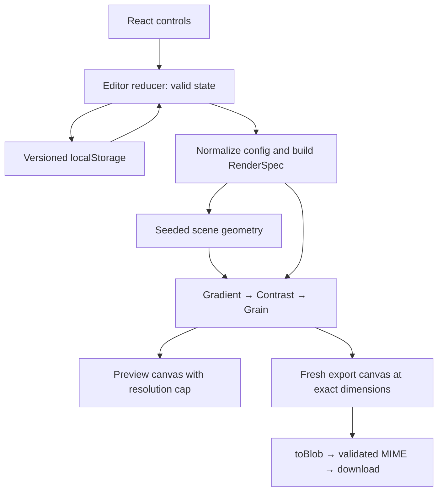

# AuraMesh 0.1.0 — Scope and implementation plan

อัปเดตแผนเมื่อ 7 ตุลาคม 2026 (Asia/Bangkok)

เอกสารนี้เป็นแผน implementation สำหรับ 0.1.0 ตาม scope ที่ปรับใน GitHub issues #1–#16 และ milestone 0.1.0 Bootstrap #1 และ model/seed/scene #3 merge เข้า dev แล้ว; gradient renderer #4 มี implementation บน feature branch ฟีเจอร์ editor/grain/contrast/export/persistence ยังเป็นแผน; ผลตรวจจริงต้องอ้างอิง handoff ของ candidate revision

## สถานะที่ตรวจพบ

- ใช้ dev เป็น integration base; bootstrap #1 merge ผ่าน [PR #17](https://github.com/Peerapat-J/AuraMesh/pull/17) แล้ว
- Model/seed/scene #3 merge ผ่าน [PR #18](https://github.com/Peerapat-J/AuraMesh/pull/18); API และกฎอยู่ใน [engine contract](engine-contract.md)
- Gradient renderer #4 อยู่ branch `PJ/issue-4-gradient-renderer`; ดู [renderer contract](renderer-contract.md) และ [QA/baseline](qa/renderer-v1.md)
- Issues #1–#16 อยู่ใน [milestone 0.1.0](https://github.com/Peerapat-J/AuraMesh/milestone/1): งานพัฒนา #1–#14, roadmap #15 และ release #16
- สถานะ issue/PR ล่าสุดให้ตรวจจาก GitHub; merge เข้า dev อาจไม่ปิด issue อัตโนมัติ เพราะ default branch ยังเป็น main
- ทุก issue มี dependencies, implementation/validation และ acceptance criteria ที่สอดคล้องกับ roadmap
- เก็บฟีเจอร์เดิมทั้งหมด รวม custom palette, persistence และ A4 ใน 0.1.0

แหล่งข้อมูลหลัก: [issue list](https://github.com/Peerapat-J/AuraMesh/issues), [roadmap #15](https://github.com/Peerapat-J/AuraMesh/issues/15)

## ผลิตภัณฑ์ที่จะสร้าง

AuraMesh เป็นเว็บแอปสร้างภาพพื้นหลังนามธรรมจากขั้นตอนการคำนวณ: ก้อนสีไล่ระดับนุ่ม ๆ ซ้อนกันคล้าย organic/mesh gradient และเพิ่ม film grain ได้ เหมาะกับ wallpaper, พื้นหลังสไลด์, artwork และพื้นหลังงานออกแบบ

ผู้ใช้เปิดเว็บ → เลือกชุดสี → Randomize หรือใส่ seed → ปรับ Softness/Spread/Grain/Contrast → เลือกขนาด → Export PNG/JPEG

ภาพสร้างใน browser ของผู้ใช้ โดย 0.1 ใช้ static hosting และไม่มี backend, account, database หรือ cloud renderer ไม่มีการใช้ AI model ในกระบวนการสร้างภาพนี้

คำว่า mesh-like ใน 0.1 หมายถึงรูปลักษณ์จาก soft elliptical fields ไม่ได้หมายถึง mathematical mesh editor ที่มี control points

## ขอบเขต 0.1

รวม:

- Editor แบบ light theme เน้น desktop และ controls เข้าถึงได้บนจอแคบ
- Built-in palettes อย่างน้อย 6 ชุด และ custom palette 3–6 สี
- Seed ที่มองเห็น แก้และคัดลอกได้; Randomize เปลี่ยนเฉพาะ seed
- Softness, Spread, Grain, Contrast และ reset ที่มีความหมายชัดเจน
- Responsive live preview ที่จำกัด backing resolution
- Square, 16:9, 4:3, 9:16, A4 portrait/landscape และ custom pixel dimensions
- PNG/JPEG export ตามขนาดจริง รวมกรณี 3840×2160 ที่ผ่านการทดสอบ
- Local session persistence ที่มี schema version และ fallback เมื่อใช้ storage ไม่ได้
- Unit/component/browser tests, keyboard/VoiceOver/manual visual QA
- Performance baseline, static production deployment และ release 0.1.0

เลื่อนไว้หลัง 0.1 ตาม roadmap เดิม: PWA, share URL, preset library, animation/video, WebGL/WebGPU, native wrapper, cloud sync, AI palette generation และ dark theme

## Scope ที่ปรับแล้วราย issue

| Issue                                                                      | ขอบเขต 0.1.0                                                                                             |
| -------------------------------------------------------------------------- | -------------------------------------------------------------------------------------------------------- |
| [#1 Bootstrap](https://github.com/Peerapat-J/AuraMesh/issues/1)            | Pin Node/pnpm, lockfile, version 0.1.0/private, README, smoke และ local/GitHub CI                        |
| [#2 Editor shell](https://github.com/Peerapat-J/AuraMesh/issues/2)         | Controls ครบ Seed/Spread, semantic labels/focus, responsive baseline และ placeholder states              |
| [#3 Config/seed/scene](https://github.com/Peerapat-J/AuraMesh/issues/3)    | Shared document/RenderSpec, ranges/defaults, seed normalization, independent streams และ rendererVersion |
| [#4 Renderer](https://github.com/Peerapat-J/AuraMesh/issues/4)             | Gradient รับ softness, common pipeline API, coordinate policy, real-browser smoke และ visual baseline    |
| [#5 Grain](https://github.com/Peerapat-J/AuraMesh/issues/5)                | Deterministic pixel grain, zero bypass, alpha/clamp tests, resolution contract และ calibration           |
| [#6 Preview/controls](https://github.com/Peerapat-J/AuraMesh/issues/6)     | Valid state/drafts, shared contrast, capped latest-state preview และ StrictMode/resize cleanup           |
| [#7 Palettes/Randomize](https://github.com/Peerapat-J/AuraMesh/issues/7)   | >=6 palettes และ reproducible Randomize ที่ได้ seed ต่างโดยไม่ reset settings                            |
| [#8 Custom palette](https://github.com/Peerapat-J/AuraMesh/issues/8)       | Working colors 3–6 สี, preset switching/reset และ shared render path                                     |
| [#9 Canvas size](https://github.com/Peerapat-J/AuraMesh/issues/9)          | Fixed pixel presets/A4/custom, per-side/total-pixel guards, preview/output isolation                     |
| [#10 Export](https://github.com/Peerapat-J/AuraMesh/issues/10)             | Shared contrast dependency #6, state snapshot, exact PNG/JPEG, MIME/failure/resource cleanup             |
| [#11 Persistence](https://github.com/Peerapat-J/AuraMesh/issues/11)        | Versioned latest document, startup hydration, blocked storage และ pending-save/reset race tests          |
| [#12 Browser regression](https://github.com/Peerapat-J/AuraMesh/issues/12) | Complete production suite จาก harness #4, required PNG/JPEG decoded dimensions และ CI artifacts          |
| [#13 UX/accessibility](https://github.com/Peerapat-J/AuraMesh/issues/13)   | Early basics/final polish, keyboard/VoiceOver/zoom/narrow access; ไม่ block ด้วย #12                     |
| [#14 Performance](https://github.com/Peerapat-J/AuraMesh/issues/14)        | Early baselines/final profiling, input/export budgets และ memory/size validation                         |
| [#15 Roadmap](https://github.com/Peerapat-J/AuraMesh/issues/15)            | Scope, contracts, order, browser policy และ release gates กลางของ 0.1.0                                  |
| [#16 Release](https://github.com/Peerapat-J/AuraMesh/issues/16)            | Static deployment, production smoke, version/changelog/tag/release notes และ rollout documentation       |

## Architecture และ implementation contract



### 1. Technology baseline

คง TypeScript strict + React + Vite + pnpm + CSS Modules + Canvas 2D ตาม issue เดิม React จัดการหน้าจอและ state ส่วน renderer เป็น imperative Canvas code ที่ไม่มี React dependency

Vitest ใช้กับ pure model/validation/reducer/pixel transforms; React Testing Library ใช้กับ interactions/errors; Playwright ใช้กับ Canvas/download/storage จริง; ESLint/Prettier/typecheck/build รันผ่าน `pnpm verify`

ไม่จำเป็นต้องเพิ่ม router, external state library หรือ UI framework สำหรับ editor หน้าเดียว

### 2. Model และ defaults

Document/scene/RenderSpec implement แล้วใน #3 ตาม [engine contract](engine-contract.md); `renderImage()` ใน #4 ทำ gradient แล้ว ส่วน contrast/grain ยังรอ #5/#6:

```ts
type EditorDocument = {
  rendererVersion: 1;
  seed: number;
  palette: {
    sourcePresetId: string | null;
    colors: string[];
  };
  appearance: {
    softness: number;
    spread: number;
    grain: number;
    contrast: number;
  };
  output: { width: number; height: number };
  exportFormat: 'png' | 'jpeg';
};

type RenderSpec = {
  scene: AuraScene;
  style: { softness: number; grain: number; contrast: number };
};

declare function buildRenderSpec(document: EditorDocument): RenderSpec;
declare function renderImage(
  ctx: CanvasRenderingContext2D,
  spec: RenderSpec,
  size: RenderSize,
): void;
```

`createScene()` รับเฉพาะ scene inputs: rendererVersion, seed, actual colors และ spread; `AuraScene` เก็บ base color, fields และ grainSeed ตาม #3 ส่วน spread มีผลต่อ field radii; softness/contrast/grain อยู่ใน style จึงไม่หายระหว่างส่งข้อมูลเข้า renderer ไม่จำเป็นต้องใช้ชื่อ type ตามนี้หาก contract เดียวกันชัดเจน

Initial ranges/defaults: softness/spread/grain 0–1 โดย defaults 0.65/0.65/0.04; contrast 0–2 โดย default 1 คือ identity; output 1920×1080, seed 1234, Ocean palette, PNG และ JPEG quality 0.92; missing/non-finite appearance fallback defaults และ finite out-of-range clamp ค่า defaults ปรับจาก visual evidence ใน #4/#5 ก่อน release ได้โดย sync constants/tests/docs พร้อมกัน

รับ seed เป็น unsigned 32-bit integer 0–4294967295 จาก UI; draft ว่าง/ติดลบ/decimal/NaN แสดง validation และคง valid seed เดิม; stored/engine seed ที่ใช้ไม่ได้ fallback 1234 ตามกฎเดียวกัน ไม่มี silent coercion ที่หลายจุดให้ผลต่างกัน

Palette รองรับ opaque `#RRGGBB` จำนวน 3–6 สี; normalize case; ไม่เก็บ metadata ที่ renderer ไม่ใช้ใน config สำหรับ scene

`presetId` และ `isCustom` ควร derive เมื่อทำได้ เพื่อลด state ที่ขัดกัน หากเก็บไว้ให้มี invariant/update rule ชัดเจน

### 3. Determinism

- `createRandom(seed)` ใช้ algorithm ที่บันทึก reference และ fixed expected-sequence fixture
- PRNG ไม่ใช้ `Math.random()` ใน scene/pixel path
- Geometry และ grain derive stream แยกจาก seed อย่าง stable ไม่ให้การเพิ่มจำนวน fields เปลี่ยน grainSeed โดยบังเอิญ
- สี/softness/contrast/grain ที่เปลี่ยนต้องไม่สุ่ม field positions ใหม่; spread เปลี่ยนขนาด fields ตามกฎ
- Randomize ใช้ `crypto.getRandomValues` ที่ขอบ UI แล้วส่ง seed เข้าระบบ deterministic
- Reproduction ต้องมี rendererVersion + seed + สีจริง + appearance + output dimensions สำหรับภาพที่ขนาดเดียวกัน
- รับรอง scene/model เหมือนเดิม และ raster repeatability ใน browser/environment เดียวกัน ไม่รับรองไฟล์ JPEG byte-for-byte ข้าม browser หรือภาพตรงกันทุก pixel ข้าม platform
- `schemaVersion: 1`, `rendererVersion: 1` และ app `0.1.0` เป็นคนละความหมาย หากเปลี่ยน algorithm ภายหลังต้องมี migration/fallback ที่แจ้งขอบเขต reproduction

### 4. Rendering

วาด base opaque → วาด elliptical radial gradients ด้วย source-over → contrast transform → monochrome grain

เริ่ม coordinate policy แบบ normalized mapping: x/radiusX เทียบ width, y/radiusY เทียบ height จึงรักษาตำแหน่งสัมพัทธ์และ coverage เมื่อเปลี่ยนสัดส่วน แต่ field shape จะปรับตาม aspect ratio โดยตั้งใจ ไม่ใช่ crop policy ซ่อนอยู่

Gradient stop falloff ทำ Softness; field coverage ทำ Spread; contrast ใช้ pixel transform ที่ใช้ร่วม preview/export โดย identity=1; grain ใช้ deterministic delta ต่อ RGB ของ pixel เดียวและคง alpha 255

Contrast แล้ว grain เป็นลำดับที่ต้องล็อกให้ตรงกัน ถ้าการอ่าน ImageData สองรอบแพงจึงค่อยรวม pixel pass หลังมี measurement

Grain ต่อ target pixel หมายความว่า texture ที่ preview resolution กับ export resolution ต่างกันได้; composition และค่าที่ใช้ต้องเหมือนกัน จึงตรวจ visual match โดย scale/ความรู้สึกของภาพ ไม่ assert checksum เท่ากันระหว่างคนละขนาด

ใช้ gradient falloff และ pixel transform เป็น baseline เพราะ `CanvasRenderingContext2D.filter` ยังมี browser availability จำกัดตาม [MDN](https://developer.mozilla.org/en-US/docs/Web/API/CanvasRenderingContext2D/filter)

Renderer ต้อง reset/save/restore context state อย่างชัดเจน ไม่ให้ transform/globalAlpha/filter/composite state จาก render ก่อนหน้าค้าง; invalid size/context failure ต้องกลับเป็นผล error ที่ UI จัดการได้

### 5. Editor และ preview

ใช้ reducer เก็บ valid document; แยก transient state เช่น seed/size draft, validation, exporting, notification ออกจาก document ที่ persist

RAF รวม updates ให้ใช้ config ล่าสุด; ResizeObserver วัด preview container; apply DPR แล้วจำกัด backing pixels เริ่มต้น <=1,048,576 pixels และ <=2048px ต่อด้าน โดยไม่แก้ export dimensions

Cleanup RAF/observer/effects เมื่อ unmount และตรวจ StrictMode ไม่สร้าง listeners/render loops ซ้ำ คง last valid preview เมื่อ draft ยังไม่ถูกต้อง

RAF ช่วยลดจำนวน renders แต่ synchronous Canvas/ImageData ยัง block main thread ได้ จึงต้องวัด input latency และ long tasks จริง ถ้าเกิน budget จึงพิจารณาลด preview resolution หรือ worker/offscreen path ไม่รับรองว่า RAF ทำ 4K export ให้ asynchronous

แยก reset semantics: Reset Appearance คืน appearance; Reset Palette คืน source preset; Reset to Defaults คืน document ทั้งหมด รวม seed/size/format และจัดการ pending storage save

### 6. Palette และ sizing

เลือก preset → copy สีเข้า working palette; edit → custom working palette; เลือก preset ใหม่ → แทน working colors; reload → คืน working palette ล่าสุด ไม่เก็บ library หลายชุดใน 0.1

Default presets ตาม #9: square 1080×1080, landscape 1920×1080, classic 1600×1200, portrait 1080×1920, A4 portrait 2480×3508, A4 landscape 3508×2480 และ custom

Initial implementation limits: min side 64px, max side 4096px และ max total pixels 16,777,216; ต้องผ่าน browser/device QA ใน #14/#16 ก่อนประกาศว่ารองรับ และ tighten limits พร้อม constants/tests/docs หากผลวัดต้องปรับ

8192×8192 RGBA buffer ใช้ 256 MiB ต่อ buffer; 3840×2160 ใช้ประมาณ 31.6 MiB ต่อ buffer ยังไม่รวม ImageData, temporary canvas และ encoder จึงใช้ per-side limit อย่างเดียวไม่เพียงพอ และ 4K desktop support ไม่แปลว่า mobile ทุกเครื่อง export ได้

A4 presets ระบุขนาด pixels/aspect ratio; ขนาด 2480×3508 ใช้วางงาน A4 ประมาณ 300 ppi ได้เมื่อกำหนดขนาดวางภาพเอง แต่ `toBlob()` ให้ resolution metadata 96dpi สำหรับ format ที่รองรับ จึงไม่ใช้ข้อความว่าไฟล์ export เป็น 300 DPI โดยไม่ได้จัดการ metadata ตาม [MDN](https://developer.mozilla.org/en-US/docs/Web/API/HTMLCanvasElement/toBlob)

### 7. Export

Capture valid document ตอนกด export → build RenderSpec → สร้าง detached HTMLCanvasElement ตาม output pixels → shared pipeline → toBlob → ตรวจ blob ไม่ null และ MIME ตรงที่ร้องขอ → download → cleanup

Detached canvas ไม่จำเป็นต้องเป็น API `OffscreenCanvas` และไม่มีการ screenshot/upscale preview ห้ามนำ devicePixelRatio ไปคูณ output dimensions

PNG opaque/lossless; JPEG opaque โดย quality เริ่มต้น 0.92; filename ใส่ palette label, seed และ dimensions เพื่อช่วย trace แต่ filename ไม่ได้เก็บ config ครบสำหรับ reproduction

ถ้า user เปลี่ยน controls ระหว่าง encode ไฟล์ยังเป็น document snapshot ตอนกด; ป้องกัน duplicate export; คืน loading state ใน finally; revoke object URL หลัง browser เริ่ม download และปล่อย resources หลังสำเร็จ/ล้มเหลว

รองรับ validation/context/allocation/toBlob failure โดย editor ใช้งานต่อได้; browser อาจ fallback format เป็น PNG จึงต้องตรวจ MIME จริงก่อนตั้งนามสกุลตาม [toBlob documentation](https://developer.mozilla.org/en-US/docs/Web/API/HTMLCanvasElement/toBlob)

### 8. Persistence

เก็บ `{ schemaVersion: 1, document: ... }` ใน `auramesh.editor`; document มี rendererVersion แยก เก็บเฉพาะ config ไม่เก็บ rendered image/scene/transient UI

Load/parse/validate ก่อน default state ถูก autosave; debounce เฉพาะ valid document changes; reset cancel pending write ก่อน clear/replace storage; cleanup timer และกำหนด bounded save/flush behavior เพื่อไม่ให้การ reload หลังปรับค่าปกติคืน state เก่า

Storage read/write/remove รวมถึงการเข้าถึง getter ต้องมี error boundary; malformed/unknown schema/unsupported renderer version fallback ตาม contract; editor/export ต้องยังทำงานใน memory เมื่อ storage ถูกบล็อก โดยไม่อ้างว่าบันทึกสำเร็จ ตาม [localStorage documentation](https://developer.mozilla.org/en-US/docs/Web/API/Window/localStorage)

ไม่ใช้ `localStorage.clear()` เพราะลบ keys อื่นของ origin; ลบเฉพาะ key ของ AuraMesh; ขอบเขต 0.1 เป็น session ล่าสุดใน browser/origin เดียว ไม่มี cloud/multi-tab synchronization guarantee

## การจัดงานและ milestone

สร้าง [Release #16](https://github.com/Peerapat-J/AuraMesh/issues/16) แยกจาก performance #14 สำหรับ hosting/base path, production smoke, README/browser/size limitations, version/changelog/tag/release notes และ deployment rollback ตาม provider

Render contracts/visual baseline รวมใน #3/#4 แล้ว ไม่สร้าง engine contract issue ซ้ำ ไม่เพิ่ม feature share URL/undo/history/AI/animation/account ใน 0.1

[Milestone 0.1.0](https://github.com/Peerapat-J/AuraMesh/milestone/1) รวม #1–#16; #15 เป็น tracking issue ไม่ใช่ feature เพิ่ม; ปิดแต่ละงานหลัง implementation และ validation ครบ ไม่ใช้สถานะ milestone แทนผลตรวจจริง

## ลำดับการทำ

| Phase                | งาน                                                   | ผลลัพธ์ที่ใช้ตัดสินว่าพร้อมไปต่อ                                                                  |
| -------------------- | ----------------------------------------------------- | ------------------------------------------------------------------------------------------------- |
| 0: Scope/contract    | #15, #3/#4 และ release #16                            | แผน/เอกสารปรับแล้ว; API, defaults, dependencies และ QA contract พร้อมเริ่ม implementation         |
| 1: Foundation        | #1                                                    | clean clone install/dev/verify และ GitHub CI ผ่าน                                                 |
| 2: ภาพแรก            | #3 → #4 พร้อม Playwright smoke; #2 ทำหลัง #1 ได้อิสระ | fixed seed วาดภาพ opaque สวยพอทั้ง square/landscape/portrait และไม่มี browser exception           |
| 3: Editor ใช้งานจริง | #5 → #6 → #7                                          | grain/controls/seed/Randomize ทำงาน ไม่มี stale preview; เก็บ latency baseline                    |
| 4: Export slice      | #9 → #10 และขยาย browser tests                        | PNG/JPEG เปิดได้ dimensions จริงตรง config ทั้ง landscape/portrait/4K; restore state หลัง failure |
| 5: ความครบของ 0.1    | #8 → #11                                              | custom colors 3–6 สีและ refresh/reopen คืน config ครบ; storage เสีย/blocked ไม่ crash             |
| 6: Release candidate | ปิด suite #12, เก็บ polish #13, profiling #14         | verify ผ่าน production build, manual QA ครบ, browser/performance limitations บันทึก               |
| 7: Release           | #16 → ปิด #15                                         | deployed core flow ผ่าน, tag/release 0.1.0 และ README/notes พร้อม                                 |

ลำดับสำหรับคนทำคนเดียว: contract → #1 → #3 → #4 → #2 → #5 → #6 → #7 → #9 → #10 → #8 → #11 → ปิด #12/#13/#14 → #16 release

ย้าย #9/#10 มาก่อน #8 เพื่อพิสูจน์งานหลักว่า “สร้างภาพแล้วเอาไฟล์ไปใช้ได้” เร็วขึ้น แต่ custom palette ยังอยู่ใน 0.1 ตามเดิม

Dependencies ที่ใช้: #10 รวม #6; #13 เริ่มหลัง #6 และ final pass หลัง #8/#10/#11 โดยไม่รอ #12 ปิด; #12 full acceptance หลัง #10/#11 แต่ harness เริ่ม #4; #16 ขึ้นกับ #12/#13/#14 และ feature acceptance ทั้งหมด; #14 baseline เริ่มตั้งแต่ #4/#5/#6/#10

แต่ละ phase เป็น checkpoint ไม่ใช่วันกำหนดส่ง ยังไม่มีข้อมูลความเร็วในการ implement/เวลาที่ใช้ฝึกจริงพอให้กำหนด ETA

## Testing และเกณฑ์ release

Unit: PRNG known sequence, same config scene equality, nonmutation, normalization, geometry, contrast identity, grain buffer determinism/alpha/clamp, reducer transitions, palette limits, total pixel validation, storage exceptions/races และ filenames

Component: valid/invalid draft, seed/slider/palette changes, reset semantics, format/loading/error, add/remove boundaries และ accessible labels/keyboard behavior ทดสอบพฤติกรรมที่มีโอกาส regression ไม่สร้าง tests เพียงตรวจ wrapper render ข้อความ

Browser: real Canvas render ตั้งแต่ #4; config A → B → A ที่ render size เดียวกัน; preview resize ไม่แก้ output config; Randomize ไม่แก้ appearance; downloaded PNG/JPEG decode ได้ MIME/signature/dimensions ถูก; DPR/zoom ไม่เปลี่ยน export dimensions; persistence/reset/corrupt/blocked storage; export failure recovery

JPEG dimensions ต้อง automated ตรวจจริงด้วย browser image decoder หรือ library ที่ใช้ใน test ได้ ไม่บังคับเขียน JPEG parser เองเป็น release blocker หากอยากฝึก parsing ให้ `image_info.mjs` เป็น learning utility เพิ่มภายหลัง

Browser policy: Chromium full suite ใน CI, Firefox/WebKit core smoke ก่อน release (automated หรือ documented real-browser manual fallback เมื่อ environment ไม่พร้อม), manual Safari บน macOS จริงสำหรับ rendering/color input/download/storage และ Chrome desktop; Playwright รองรับ [หลาย browser projects](https://playwright.dev/docs/test-projects) แต่ WebKit test ไม่แทน Safari manual ทั้งหมด บันทึก browser/OS versions ที่ทดสอบจริง

Manual visual matrix: fixed seed × palettes × softness/spread extremes × grain 0/low/max × contrast min/identity/max; square/portrait/landscape; PNG/JPEG 4K; ดูภาพที่ 100% และ scaled view; ตรวจ hard edges, muddy/washed colors, banding, clipping, grain artifacts, alpha และ preview/export composition

Manual interaction: rapid sliders/Randomize, color picker, resize/Retina, keyboard-only flow, VoiceOver controls, zoom 125/150/200%, 390px narrow layout และเปิดไฟล์ download จริง

Performance: measure scene generation, gradient, pixel passes, blob encoding และ end-to-end export แยก; fixed config หลาย runs รวม warm-up, median/min/max และ browser/device; เก็บ worst representative scene ไม่เลือกเฉพาะ sample ที่เร็วที่สุด; repeated export ตรวจ resource/memory trend; ตั้ง latency budgets จาก baseline ก่อน release ไม่ใช้ timing CI ที่ noisy เป็น hard gate โดยทันที

Release 0.1.0 ผ่านเมื่อ:

- [ ] ฟีเจอร์ #1–#11 ครบตาม scope และ acceptance ที่ปรับแล้ว
- [ ] `pnpm verify` ผ่าน lint/format/typecheck/unit/component/build/browser tests
- [ ] PNG และ JPEG exact dimensions ถูกตรวจ automated และไฟล์ 4K เปิดด้วยมือแล้ว
- [ ] same rendererVersion/config/seed reproduce scene และ same-environment raster ตาม contract
- [ ] responsive/keyboard/VoiceOver และ manual visual QA มีผลบันทึก
- [ ] error/storage/export recovery ใช้งานได้ ไม่ทำ document เสีย
- [ ] browser support/output limits/performance baseline บันทึกจากการทดสอบจริง
- [ ] deployed URL โหลด static assets ถูก path และ core flow ผ่าน production smoke
- [ ] README, version 0.1.0, changelog/release notes และ release tag พร้อม

## แนวทาง implement เพื่อการฝึก

รักษา learning-first ตาม #15: เขียน random/scene/renderer/grain/reducer/preview/export ด้วยตัวเองเป็นส่วน ๆ แล้วใช้ AI อธิบาย API, review, ช่วย debug และเสนอ test cases

หนึ่ง issue อาจแตกเป็น PR เล็กหลาย PR เมื่อจำเป็น เช่น #12 harness ก่อนและ suite ภายหลัง ไม่มีการรวม engine/editor/export/persistence ทั้งหมดใน PR เดียว

ทุก handoff แยก automated checks ที่รันจริง, manual QA ที่ทำจริง และรายการยังไม่ตรวจ ไม่ถือว่า build ผ่านพิสูจน์ visual quality หรือ browser behavior แล้ว

## สถานะ implementation และข้อจำกัด

Scope และ issue metadata ปรับแล้ว; #1/#3 merge เข้า dev และ gradient renderer #4 มี implementation บน feature branch พร้อม Chromium smoke และ initial visual/performance evidence ใน [QA record](qa/renderer-v1.md) ผลนี้ยังไม่ครอบคลุม editor/grain/contrast/export/persistence หรือ release readiness ตัวเลข preview cap/defaults และ output limits ยังต้องวัดกับ pipeline เต็มก่อน release
